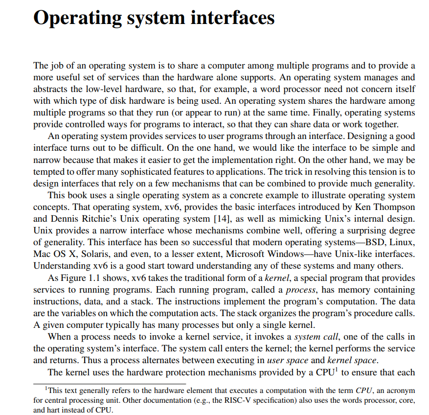
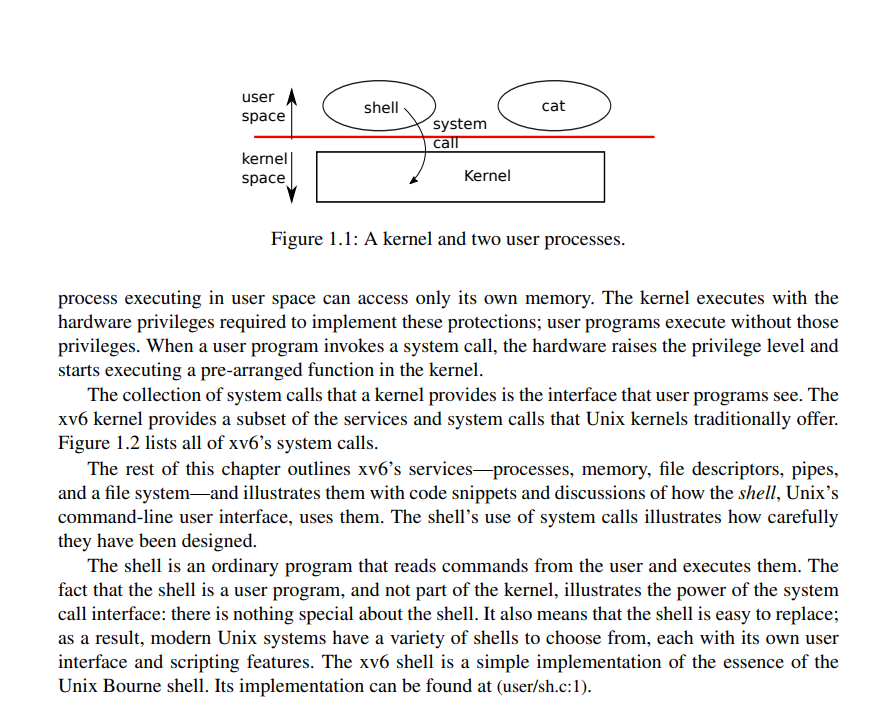

# xv6 Chapter1

# 操作系统接口

操作系统的任务是在多个程序之间共享计算机，并提供比硬件单独支持更有用的服务集合。操作系统管理并抽象底层硬件，例如，文字处理器无需关心正在使用的是哪种磁盘硬件。操作系统在多个程序之间共享硬件，使它们能够同时（或看似同时）运行。最后，操作系统为程序提供受控的交互方式，以便它们能够共享数据或协同工作。

操作系统通过接口向用户程序提供服务。设计一个好的接口非常困难。一方面，我们希望接口简单而狭窄，因为这使得实现更容易正确。另一方面，我们可能希望为应用程序提供许多复杂的功能。解决这种矛盾的关键在于设计依赖于少量机制的接口，这些机制可以组合起来提供极大的通用性。

本书使用一个单一的操作系统作为具体示例来说明操作系统概念。这个操作系统，xv6，提供了由 Ken Thompson 和 Dennis Ritchie 的 Unix 操作系统 [14] 引入的基本接口，并模仿了 Unix 的内部设计。Unix 提供了一个狭窄的接口，其机制能够很好地结合，提供了惊人的通用性。这个接口非常成功，以至于现代操作系统——BSD、Linux、Mac OS X、Solaris，甚至在较小程度上包括 Microsoft Windows——都拥有类 Unix 的接口。理解 xv6 是理解这些系统及许多其他系统的良好开端。

如图 1.1 所示，xv6 采用了**内核** 的传统形式，内核是一个向运行中的程序提供服务的特殊程序。每个运行中的程序，称为**进程**，拥有包含指令、数据和栈的内存。指令实现了程序的运算。数据是运算所操作的变量。栈组织程序的过程调用。一台给定的计算机通常有许多进程，但只有一个内核。

当一个进程需要调用内核服务时，它会调用**系统调用**，这是操作系统接口中的一种调用。系统调用进入内核；内核执行服务然后返回。因此，一个进程在**用户空间** 和**内核空间** 中交替执行。

内核利用 CPU 提供的硬件保护机制来确保每个进程

------

###### "本文通常使用术语 **CPU**（中央处理单元的缩写）来指代执行计算的硬件元件。其他文献（例如 RISC-V 规范）也使用处理器（processor）、核心（core）和硬件线程（hart）这些词来替代 CPU。"

在用户空间执行的每个进程只能访问自己的内存。内核在实现这些保护机制所需的硬件特权级别下运行，而用户程序则在没有这些特权的情况下运行。当用户程序调用系统调用时，硬件会提升特权级别，并开始执行内核中预先设定的函数。

**内核提供的系统调用集合就是用户程序所见的接口。**xv6 内核提供了传统 Unix 内核所提供服务及系统调用的一个子集。图 1.2 列出了 xv6 的所有系统调用。

本章剩余部分将概述 xv6 提供的服务——进程、内存、文件描述符、管道和文件系统——并通过代码片段以及关于 **shell**（Unix 的命令行用户界面）如何使用这些服务的讨论来加以说明。Shell 对系统调用的使用，充分体现了其设计的精巧之处。

Shell 是一个普通的程序，它从用户读取命令并执行。Shell 作为用户程序，而非内核的一部分，这一事实体现了系统调用接口的强大能力：Shell 本身并无任何特殊之处。这也意味着 Shell 很容易被替换。因此，现代的 Unix 系统拥有多种不同的 Shell 可供选择，每一种都有其独特的用户界面和脚本功能。Xv6 的 Shell 是对 Unix Bourne Shell 核心功能的一个简单实现，其代码位于 (user/sh.c:1)。