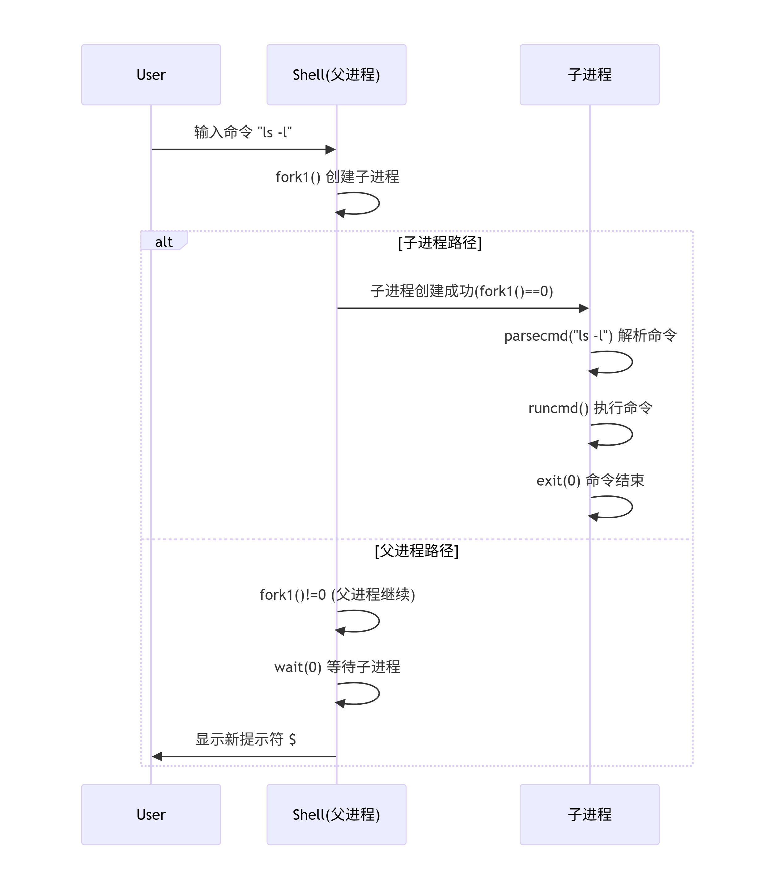

# xv6 Chapter1

# 操作系统接口

操作系统的任务是在多个程序之间共享计算机，并提供比硬件单独支持更有用的服务集合。操作系统管理并抽象底层硬件，例如，文字处理器无需关心正在使用的是哪种磁盘硬件。操作系统在多个程序之间共享硬件，使它们能够同时（或看似同时）运行。最后，操作系统为程序提供受控的交互方式，以便它们能够共享数据或协同工作。

操作系统通过接口向用户程序提供服务。设计一个好的接口非常困难。一方面，我们希望接口简单而狭窄，因为这使得实现更容易正确。另一方面，我们可能希望为应用程序提供许多复杂的功能。解决这种矛盾的关键在于设计依赖于少量机制的接口，这些机制可以组合起来提供极大的通用性。

本书使用一个单一的操作系统作为具体示例来说明操作系统概念。这个操作系统，xv6，提供了由 Ken Thompson 和 Dennis Ritchie 的 Unix 操作系统 [14] 引入的基本接口，并模仿了 Unix 的内部设计。Unix 提供了一个狭窄的接口，其机制能够很好地结合，提供了惊人的通用性。这个接口非常成功，以至于现代操作系统——BSD、Linux、Mac OS X、Solaris，甚至在较小程度上包括 Microsoft Windows——都拥有类 Unix 的接口。理解 xv6 是理解这些系统及许多其他系统的良好开端。

如图 1.1 所示，xv6 采用了**内核** 的传统形式，内核是一个向运行中的程序提供服务的特殊程序。每个运行中的程序，称为**进程**，拥有包含指令、数据和栈的内存。指令实现了程序的运算。数据是运算所操作的变量。栈组织程序的过程调用。一台给定的计算机通常有许多进程，但只有一个内核。

当一个进程需要调用内核服务时，它会调用**系统调用**，这是操作系统接口中的一种调用。系统调用进入内核；内核执行服务然后返回。因此，一个进程在**用户空间** 和**内核空间** 中交替执行。

内核利用 CPU 提供的硬件保护机制来确保每个进程

------

###### "本文通常使用术语 **CPU**（中央处理单元的缩写）来指代执行计算的硬件元件。其他文献（例如 RISC-V 规范）也使用处理器（processor）、核心（core）和硬件线程（hart）这些词来替代 CPU。"


在用户空间执行的每个进程只能访问自己的内存。内核在实现这些保护机制所需的硬件特权级别下运行，而用户程序则在没有这些特权的情况下运行。当用户程序调用系统调用时，硬件会提升特权级别，并开始执行内核中预先设定的函数。

**内核提供的系统调用集合就是用户程序所见的接口**。xv6 内核提供了传统 Unix 内核所提供服务及系统调用的一个子集。图 1.2 列出了 xv6 的所有系统调用。

本章剩余部分将概述 xv6 提供的服务——进程、内存、文件描述符、管道和文件系统——并通过代码片段以及关于 **shell**（Unix 的命令行用户界面）如何使用这些服务的讨论来加以说明。Shell 对系统调用的使用，充分体现了其设计的精巧之处。

Shell 是一个普通的程序，它从用户读取命令并执行。Shell 作为用户程序，而非内核的一部分，这一事实体现了系统调用接口的强大能力：Shell 本身并无任何特殊之处。这也意味着 Shell 很容易被替换。因此，现代的 Unix 系统拥有多种不同的 Shell 可供选择，每一种都有其独特的用户界面和脚本功能。Xv6 的 Shell 是对 Unix Bourne Shell 核心功能的一个简单实现，其代码位于 ([user/sh.c:1](https://github.com/mit-pdos/xv6-riscv/blob/riscv/user/sh.c#L1))。

## 1.1 进程与内存

一个 xv6 进程由用户空间内存（指令、数据和栈）以及内核私有的每个进程状态组成。Xv6 使用时间片轮转调度进程：它在等待执行的进程集合之间透明地切换可用的 CPU。当一个进程未执行时，xv6 会保存其 CPU 寄存器，并在下次运行该进程时恢复它们。内核为每个进程关联一个进程标识符（PID）。

一个进程可以使用 fork 系统调用创建一个新进程。Fork 会创建一个新进程，称为子进程，其内存内容与调用它的进程（称为父进程）完全相同。Fork 在父进程和子进程中都会返回。在父进程中，fork 返回子进程的 PID；在子进程中，fork 返回零。

例如，考虑以下用 C 语言编写的程序片段 [6]	

| 系统调用                              | 描述                                                         |
| ------------------------------------- | ------------------------------------------------------------ |
| int fork()                            | 创建一个进程，返回子进程的PID。                              |
| int exit(int status)                  | 终止当前进程；状态已报告给 wait()。无返回。                  |
| int wait(int *status)                 | 等待子进程退出；退出状态保存在 *status 中；返回子进程 PID。  |
| int kill(int pid)                     | 终止进程 PID。返回 0，出错返回 -1                            |
| int getpid()                          | 返回当前进程的 PID                                           |
| int sleep(int n)                      | 暂停 n 个时钟周期。                                          |
| char *sbrk(int n)                     | 将进程的内存增加 n 字节。返回新内存的起始位置。              |
| int open(char *file, int flags)       | 打开一个文件；标志表示读/写；返回一个文件描述符 (fd)         |
| int write(int fd, char *buf, int n)   | 从 buf 写入 n 字节到文件描述符 fd；返回写入的字节数 n。      |
| int read(int fd, char *buf, int n)    | 读取 n 个字节到缓冲区 buf；返回实际读取的字节数；如果到达文件末尾则返回 0。 |
| int close(int fd)                     | 释放打开的文件描述符。                                       |
| int dup(int fd)                       | 返回一个新的文件描述符，该描述符指向与 fd 相同的文件。       |
| int pipe(int p[])                     | 创建一个管道，将读/写文件描述符放入 p[0] 和 p[1] 中。        |
| int chdir(char *dir)                  | 更改当前目录                                                 |
| int mkdir(char *dir)                  | 创建一个新目录。                                             |
| int mknod(char *file, int, int)       | 创建一个设备文件。                                           |
| int fstat(int fd, struct stat *st)    | 将有关打开文件的信息放入 *st                                 |
| int stat(char *file, struct stat *st) | 将有关指定文件的信息放入 *st。                               |
| int link(char *file1, char *file2)    | 为文件 file1 创建另一个名称 (file2)                          |
| int unlink(char *file)                | 删除一个文件。                                               |

以上：Xv6 系统调用。如果没有另行说明，这些调用在没有错误时返回 0，出现错误时返回 -1

```C
 int pid = fork();
 if(pid > 0){
	printf("parent: child=%d\n", pid)
 	pid = wait((int *) 0);
 	printf("child %d is done\n", pid);
 } else if(pid == 0){
 	printf("child: exiting\n");
 	exit(0);
 } else {
 	printf("fork error\n");
 }
```

exit 系统调用会导致调用进程停止执行，并释放诸如内存和打开文件等资源。exit 接受一个整数状态参数，通常约定 0 表示成功，1 表示失败。wait 系统调用返回当前进程已退出（或被终止）子进程的 PID，并将子进程的退出状态复制到传给 wait 的地址中；如果调用者的子进程没有退出，wait 会等待其中一个退出。如果调用者没有子进程，wait 会立即返回 -1。如果父进程不关心子进程的退出状态，可以将 0 作为地址传给 wait。

在这个例子中，输出行

```C
parent: child=1234
child: exiting
```

可能会以任一顺序输出，这取决于父进程或子进程谁先执行其 printf 调用。在子进程退出后，父进程的 wait 返回，导致父进程打印。

```C
 parent: child 1234 is done
```

虽然子进程最初拥有与父进程相同的内存内容，但父进程和子进程是在不同的内存和寄存器中执行的：在一个中改变变量不会影响另一个。例如，当 wait 的返回值存储到父进程中的 pid 时，并不会改变子进程中的 pid 变量。子进程中的 pid 值仍然是零。exec 系统调用用从文件系统中加载的新的内存映像替换调用进程的内存。该文件必须具有特定格式，指定文件的哪一部分存放指令，哪一部分是数据，从哪个指令开始执行等。xv6 使用 ELF 格式，第三章中有更详细的讨论。当 exec 成功执行时，它不会返回到调用程序；相反，从文件加载的指令会在 ELF 头中声明的入口点开始执行。exec 接受两个参数：包含可执行文件的文件名和一个字符串参数数组。例如：

```C
 char *argv[3];
 argv[0] = "echo";
 argv[1] = "hello";
 argv[2] = 0;
 exec("/bin/echo", argv);
 printf("exec error\n")
```

该片段将调用程序替换为一个/bin/echo程序实例，并使用参数列表echo hello运行。大多数程序会忽略参数数组的第一个元素，这个元素通常是程序的名称。argv[0]是程序名称。

xv6 shell使用上述调用代表用户运行程序。shell的主要结构很简单；参见main（[user/sh.c:145](https://github.com/mit-pdos/xv6-riscv/blob/riscv/user/sh.c#L145)）。主循环通过getcmd从用户读取一行输入。然后它调用fork，创建shell进程的副本。父进程调用wait，而子进程运行命令。例如，如果用户在shell中输入“echo hello”，那么runcmd将以“echo hello”作为参数被调用。

sh.c#L145 to L196 代码片段分析：

```C
int
main(void)
{
  static char buf[100];
  int fd;

  // Ensure that three file descriptors are open.
  while((fd = open("console", O_RDWR)) >= 0){
    if(fd >= 3){
      close(fd);
      break;
    }
  }

  // Read and run input commands.
  while(getcmd(buf, sizeof(buf)) >= 0){
    char *cmd = buf;
    while (*cmd == ' ' || *cmd == '\t')
      cmd++;
    if (*cmd == '\n') // is a blank command
      continue;
    if(cmd[0] == 'c' && cmd[1] == 'd' && cmd[2] == ' '){
      // Chdir must be called by the parent, not the child.
      cmd[strlen(cmd)-1] = 0;  // chop \n
      if(chdir(cmd+3) < 0)
        fprintf(2, "cannot cd %s\n", cmd+3);
    } else {
      if(fork1() == 0)
        runcmd(parsecmd(cmd));
      wait(0);
    }
  }
  exit(0);
}
// 错误终止
void
panic(char *s)
{
  fprintf(2, "%s\n", s); // 将指针指向的内容输出到stderr 
  exit(1);
}

int
fork1(void)
{
  int pid;

  pid = fork();
  if(pid == -1)
    panic("fork");
  return pid;
}
```

首先看：

```C
// Ensure that three file descriptors are open.
  while((fd = open("console", O_RDWR)) >= 0){
    if(fd >= 3){
      close(fd);
      break;
    }
  }
```

`O_RDWR` : 以读写方式打开

Linux 是默认占用了fd(文件描述符)的0，1， 2，fd >= 3是说打开控制台成功了。

然后执行`getcmd(buf, sizeof(buf))`

```C
int
getcmd(char *buf, int nbuf)
{
  // 向标准错误写入："$ "
  write(2, "$ ", 2);
  // memset(目标地址，填充值，填充长度)
  // 清空缓冲区
  memset(buf, 0, nbuf);
  // 从标准输入读取一行文本，存入 buf，最多读取 nbuf-1 个字符,字符串以\0结尾
  gets(buf, nbuf);
  if(buf[0] == 0) // EOF
    return -1;
  return 0;
}
```

```C
 // Read and run input commands.
 // 读到的不为空
  while(getcmd(buf, sizeof(buf)) >= 0){
    char *cmd = buf;
    // 跳过跳过空白字符
    while (*cmd == ' ' || *cmd == '\t')
      cmd++;
    // 跳过空白字符后 直接换行
    if (*cmd == '\n') // is a blank command
      continue;
    // 如果是cd空格 xxx 而不是cdxxx其它指令
    if(cmd[0] == 'c' && cmd[1] == 'd' && cmd[2] == ' '){
      // Chdir must be called by the parent, not the child.
      // 最后一个字符(应该是\n)替换为'\0'
      cmd[strlen(cmd)-1] = 0;  // chop \n
      // chdir 是改变当前进程的目录, 需要在父进程下执行，如果在子进程退出以后执行，子进程退出后父进程目录不变
      // 输入: "cd /home/user\n"
      // cmd指向: 'c' 'd' ' ' '/' 'h' 'o' 'm' 'e' '/' 'u' 's' 'e' 'r' '\n'
      //          ↑
      //         cmd
      if(chdir(cmd+3) < 0)
        fprintf(2, "cannot cd %s\n", cmd+3);
    } else {
      // 子进程解析命令后执行命令
      // 如果是父进程直接执行指令,exec后就直接被kill了
      if(fork1() == 0)
        runcmd(parsecmd(cmd));
      wait(0);
    }
  }
  exit(0);
}
```

示例代码：

```C
// suicide_shell.c - 演示Shell如何“自杀”
#include <stdio.h>
// 基础系统调用接口
#include <unistd.h>

int main() {
    printf("My Shell (PID: %d)\n", getpid());
    printf("I will run 'ls' and die...\n");
    
    char *args[] = {"ls", "-l", NULL};
    // 将当前进程的代码、数据、堆栈完全替换为另一个程序的, 进程ID不变
    execvp("ls", args);  // 自杀式执行
    
    // 以下代码永远不会执行
    printf("I'm dead! You won't see this.\n");
    return 0;
}
```





runcmd（[user/sh.c[:58](https://github.com/mit-pdos/xv6-riscv/blob/riscv/user/sh.c#L58)）运行实际的命令。

```assembly
// 1. 没有noreturn时生成的汇编（伪代码）：
runcmd:
    push    %rbp		  ; 把基址指针寄存器的值保存到栈
    ; rsp（Stack Pointer）栈顶指针，总是指向栈的最顶部
    ; rbp（Base Pointer）：基址指针，用来标记当前函数栈帧的起始位置
    mov     %rsp, %rbp    ; mov destination, source, 把rsp的值赋值给rbp
    call    exit	
    pop     %rbp          ; 理论上exit不返回，但编译器保守生成
    ret                    ; 返回指令（死代码）

// 2. 有noreturn时生成的汇编：
runcmd:
    jmp     exit           ; 直接跳转，不建栈帧，不返回
    ; 没有ret指令！
```

```C
// __attribute__ 添加元信息
// ((noreturn)) 特定属性，表示函数不会返回调用者，no return
// const, volatile 告诉编译器优化
// 
void runcmd(struct cmd*) __attribute__((noreturn));

// Execute cmd.  Never returns.
void
runcmd(struct cmd *cmd)
{
  int p[2];	// 管道文件描述符,p[0] = 读端, p[1] = 写端
  struct backcmd *bcmd; // 指向后台命令结构的指针
  struct execcmd *ecmd; // 指向可执行命令结构的指针
  struct listcmd *lcmd; // 指向命令列表（分号分隔）结构的指针
  struct pipecmd *pcmd; // 指向管道命令结构的指针
  struct redircmd *rcmd; // 指向重定向命令结构的指针

  if(cmd == 0)  // 如果传入的 cmd 指针为空
    exit(1);	// 直接退出（错误码1）

  switch(cmd->type){
  default:
    panic("runcmd");
  // EXEC是定义的宏 1
  // 处理 ls -l
  case EXEC:
    ecmd = (struct execcmd*)cmd;
    // char *argv[MAXARGS]; 指针数组
    // argv[0], argv[1] ... argv[MAXARGS]都是char *指针
    // 比如 ls -l /home 
    //	argv[0] = "ls\0" 程序名
    // 	argv[1] = "-l" 第一个参数
    if(ecmd->argv[0] == 0)
      exit(1);
    // argv[0] 是char *指针
    // argv 是char *[]，是个数组，每个元素都是char *指针
    // exec(char *name, char *argv[]);
    // exec("ls", ["ls", "-l", "/home", NULL]);
    // exec执行成功无返回值
    exec(ecmd->argv[0], ecmd->argv);
    fprintf(2, "exec %s failed\n", ecmd->argv[0]);
    break;

  case REDIR:
    rcmd = (struct redircmd*)cmd;
    close(rcmd->fd);
    if(open(rcmd->file, rcmd->mode) < 0){
      fprintf(2, "open %s failed\n", rcmd->file);
      exit(1);
    }
    runcmd(rcmd->cmd);
    break;

  case LIST:
    lcmd = (struct listcmd*)cmd;
    if(fork1() == 0)
      runcmd(lcmd->left);
    wait(0);
    runcmd(lcmd->right);
    break;

  case PIPE:
    pcmd = (struct pipecmd*)cmd;
    if(pipe(p) < 0)
      panic("pipe");
    if(fork1() == 0){
      close(1);
      dup(p[1]);
      close(p[0]);
      close(p[1]);
      runcmd(pcmd->left);
    }
    if(fork1() == 0){
      close(0);
      dup(p[0]);
      close(p[0]);
      close(p[1]);
      runcmd(pcmd->right);
    }
    close(p[0]);
    close(p[1]);
    wait(0);
    wait(0);
    break;

  case BACK:
    bcmd = (struct backcmd*)cmd;
    if(fork1() == 0)
      runcmd(bcmd->cmd);
    break;
  }
  exit(0);
}

int
getcmd(char *buf, int nbuf)
{
  write(2, "$ ", 2);
  memset(buf, 0, nbuf);
  gets(buf, nbuf);
  if(buf[0] == 0) // EOF
    return -1;
  return 0;
}

```

对于“echo hello”，它会调用exec（[user/sh.c:78](https://github.com/mit-pdos/xv6-riscv/blob/riscv/user/sh.c#L78)）。如果exec成功，那么子进程将执行echo中的指令，而不是runcmd。在某个时候，echo会调用exit，这将导致父进程从main中的wait返回（[user/sh.c:145](https://github.com/mit-pdos/xv6-riscv/blob/riscv/user/sh.c#L145)）。

你可能会想，为什么fork和exec没有合并为一个调用；我们稍后会看到，shell在实现I/O重定向时利用了这种分离。为了避免创建重复进程然后立即替换（使用exec）的浪费，操作系统内核通过使用诸如写时复制（copy-on-write）的虚拟内存技术优化了fork在这种用例下的实现（参见第4.6节）。

Xv6隐式地分配大部分用户空间内存：fork分配子进程所需的父进程内存副本，而exec分配足够的内存以容纳可执行文件。一个在运行时需要更多内存的进程（可能是为了 malloc）可以调用 sbrk(n) 来将其数据内存增加 n 字节；sbrk 会返回新内存的位置。


## 1.2 输入/输出和文件描述符

文件描述符是表示内核管理对象的小整数，进程可以从中读取数据或向其写入数据。进程可以通过打开文件、目录或设备、创建管道，或复制现有描述符来获得文件描述符。为了简化，我们通常将文件描述符指向的对象称为“文件”；文件描述符接口隐藏了文件、管道和设备之间的差异，使它们看起来都像字节流。我们将输入和输出统称为 I/O。

在内部，xv6 内核使用文件描述符作为每个进程表的索引，因此每个进程都有从零开始的私有文件描述符空间。按照惯例，进程从文件描述符 0（标准输入）读取，从文件描述符 1（标准输出）写入输出，并向文件描述符 2（标准错误）写入错误信息。正如我们将看到的，shell 利用这一惯例实现 I/O 重定向和管道。shell 确保它始终打开三个文件描述符（[user/sh.c:151](https://github.com/mit-pdos/xv6-riscv/blob/riscv//user/sh.c#L151)）

```C
 // Ensure that three file descriptors are open.
  while((fd = open("console", O_RDWR)) >= 0){
    if(fd >= 3){
      close(fd);
      break;
    }
  }
```

，这些文件描述符默认对应于控制台。

系统调用 read 和 write 从打开的文件（由文件描述符指定的文件）读取字节或写入字节。调用 read(fd, buf, n) 从文件描述符 fd 读取最多 n 个字节，将它们复制到 buf 中，并返回读取的字节数。每个指向文件的文件描述符都有一个关联的偏移量。read 从当前文件偏移量读取数据，然后将该偏移量前进读取的字节数：随后再执行读操作时，将返回紧随第一次读操作后面的字节。当没有更多字节可读时，read 返回零，以表示文件结束。

调用 write(fd, buf, n) 将 buf 中的 n 个字节写入文件描述符 fd，并返回写入的字节数。只有在发生错误时，写入字节数才可能少于 n。与 read 类似，write 在当前文件偏移位置写入数据，然后将该偏移量前进写入的字节数：每次写操作都从上一次结束的地方开始。

下面的程序片段（构成程序 cat 的核心）将数据从标准输入复制到标准输出。如果发生错误，它会向标准错误写入一条消息。

```C
 char buf[512];
 int n;
 for(;;){
 	n = read(0, buf, sizeof buf);
 	if(n == 0)
 		break;
 	if(n < 0){
 	fprintf(2, "read error\n");
 	exit(1);
 }
 if(write(1, buf, n) != n){
 	fprintf(2, "write error\n");
 	exit(1);
 	}
 }
```

在代码片段中需要注意的重要一点是，cat 并不知道它是在从文件、控制台还是管道读取。同样，cat 也不知道它是将内容打印到控制台、文件还是其他地方。使用文件描述符以及文件描述符 0 表示输入、文件描述符 1 表示输出的约定，使得 cat 可以简单实现。

close 系统调用会释放一个文件描述符，使其可被将来的 open、pipe 或 dup 系统调用重用（见下文）。新分配的文件描述符总是当前进程中编号最小的未使用描述符。

文件描述符和 fork 的交互使得实现 I/O 重定向变得容易。Fork 会复制父进程的文件描述符表及其内存，因此子进程一开始具有与父进程完全相同的打开文件。系统调用 exec 会替换调用进程的内存，但保留其文件表。这种行为允许 shell 通过 fork，在子进程中重新打开所选文件描述符，然后调用 exec 运行新程序来实现 I/O 重定向。下面是 shell 对命令 cat < input.txt 运行的代码的简化版本。

```
char *argv[2];
 argv[0] = "cat";
 argv[1] = 0;
 if(fork() == 0) {
 	close(0);
 	open("input.txt", O_RDONLY);
 	exec("cat", argv);
 }
```

在子进程关闭文件描述符 0 之后，open 保证会使用该文件描述符来打开新的 input.txt：0 将是最小的可用文件描述符。然后 cat 在文件描述符 0（标准输入）指向 input.txt 的情况下执行。父进程的文件描述符不会因为这个操作而改变，因为它只修改了子进程的描述符。

xv6 shell 中用于输入/输出重定向的代码就是以这种方式工作的（[user/sh.c:82](https://github.com/mit-pdos/xv6-riscv/blob/riscv//user/sh.c#L82)）。

```C
  case REDIR:
    rcmd = (struct redircmd*)cmd;
    close(rcmd->fd);
    if(open(rcmd->file, rcmd->mode) < 0){
      fprintf(2, "open %s failed\n", rcmd->file);
      exit(1);
    }
    runcmd(rcmd->cmd);
    break;
```

```C
int
main(void)
{
  static char buf[100];
  int fd;

  // Ensure that three file descriptors are open.
  while((fd = open("console", O_RDWR)) >= 0){
    if(fd >= 3){
      close(fd);
      break;
    }
  }

  // Read and run input commands.
  while(getcmd(buf, sizeof(buf)) >= 0){
    char *cmd = buf;
    while (*cmd == ' ' || *cmd == '\t')
      cmd++;
    if (*cmd == '\n') // is a blank command
      continue;
    if(cmd[0] == 'c' && cmd[1] == 'd' && cmd[2] == ' '){
      // Chdir must be called by the parent, not the child.
      cmd[strlen(cmd)-1] = 0;  // chop \n
      if(chdir(cmd+3) < 0)
        fprintf(2, "cannot cd %s\n", cmd+3);
    } else {
      if(fork1() == 0)
        runcmd(parsecmd(cmd));
      wait(0);
    }
  }
  exit(0);
}
```

回想一下，此时代码执行到这一点时，shell 已经 fork 了子 shell，并且 runcmd 将调用 exec 来加载新的程序。

open 的第二个参数由一组标志位组成，这些标志用于控制 open 的行为。可能的值在控制 (fcntl) 头文件（[kernel/fcntl.h:1-5]([xv6-riscv/kernel/fcntl.h at riscv · mit-pdos/xv6-riscv · GitHub](https://github.com/mit-pdos/xv6-riscv/blob/riscv//kernel/fcntl.h#L1-L5))）中定义：

```C
#define O_RDONLY  0x000
#define O_WRONLY  0x001
#define O_RDWR    0x002
#define O_CREATE  0x200
#define O_TRUNC   0x400
```

O_RDONLY、O_WRONLY、O_RDWR、O_CREATE 和 O_TRUNC，它们分别指示 open 以只读、只写或读写方式打开文件，如果文件不存在则创建文件，以及**如果文件已存在，将其长度截断为0**(清空文件内容)。

现在应该清楚为什么 fork 和 exec 是分开调用是有帮助的：在两者之间，shell 有机会重定向子进程的 I/O，而不会干扰主 shell 的 I/O 设置。人们也可以设想一个假设的组合 forkexec 系统调用，但使用这样的调用进行 I/O 重定向的方式似乎很尴尬。shell 可以在调用 forkexec 之前修改自己的 I/O 设置（然后再撤销这些修改）；或者 forkexec 可以将 I/O 重定向的指令作为参数；或者（最不理想的）每个像 cat 这样的程序都被教导去自己进行 I/O 重定向。尽管 fork 会复制文件描述符表，但每个底层文件偏移在父进程和子进程之间是共享的。考虑这个例子：

```C
if(fork() == 0) {
 	write(1, "hello ", 6);
 	exit(0);
 } else {
 	wait(0);
 	write(1, "world\n", 6);
 }
```

在这个片段的末尾，附加到文件描述符1的文件将包含数据 hello world。父进程中的写操作（由于 wait 的作用，只在子进程完成后才运行）会从子进程写入的位置继续写。这种行为有助于从一系列 shell 命令生成顺序输出，例如 (echo hello; echo world) >output.txt。

dup 系统调用会复制一个已存在的文件描述符，返回一个指向相同底层 I/O 对象的新描述符。两个文件描述符共享一个偏移量，就像 fork 复制的文件描述符一样。这是将 hello world 写入文件的另一种方式

```C
 fd = dup(1);
 write(1, "hello ", 6);
 write(fd, "world\n", 6)
```

写入和读取不同，不需要考虑‘\0’

```C
// 写入时：我只管"写什么"和"写多少"
write(fd, "hello\n", 6);  // 写入6个字节

// 读取时：我指定"读多少"
char buf[100];
int n = read(fd, buf, 100);  // 最多读100字节
buf[n] = '\0';  // ← 如果需要作为C字符串使用，我自己加\0
```

如果两个文件描述符是通过一系列 fork 和 dup 调用从同一个原始文件描述符派生出来的，那么它们会共享偏移量。否则，即使文件描述符是通过对同一个文件的 open 调用产生的，它们也不会共享偏移量。dup 允许 shell 实现如下命令：ls existing-file non-existing-file > tmp1 2>&1。2>&1 告诉 shell 将命令的文件描述符 2 设置为描述符 1 的副本。现有文件的名称和不存在文件的错误信息都会显示在 tmp1 文件中。

xv6 shell 不支持错误文件描述符的 I/O 重定向，但现在你知道如何实现它。文件描述符是一种强大的抽象，因为它们隐藏了它们所连接对象的细节：进程写入文件描述符 1 时，可能是在写入文件、像控制台这样的设备，或者是管道。

## 1.3 Pipes

管道是一个小的内核缓冲区，以一对文件描述符的形式暴露给进程，一个用于读取，一个用于写入。向管道的一端写入数据可以使这些数据从管道的另一端读取。管道为进程之间提供了一种通信方式。

以下示例代码运行程序 wc（单词计数）【**Word Count**】，并将标准输入连接到管道的读取端。

```
$ wc -l udp_server.py 
14 udp_server.py
```

我们拿cat验证：

```shell
cat -n udp_server.py 
```

确实是14行

看以下代码：

```C
int p[2];
char *argv[2];
argv[0] = "wc"; // 程序名是wc
argv[1] = 0;
pipe(p);// 创建管道
if(fork() == 0) {
	close(0);
    // dup返回一个新的文件描述符(当前最小可用fd)，该描述符指向与 fd 相同的文件。
 	dup(p[0]); // p[0]读取端，p[1]写入端
 	close(p[0]);
 	close(p[1]);
 	exec("/bin/wc", argv);
} else {
	close(p[0]);
	write(p[1], "hello world\n", 12);
	close(p[1]);
}
```

执行前状态：

```
文件描述符表：
0: stdin     (标准输入)
1: stdout    (标准输出)
2: stderr    (标准错误)
3: p[0]      (管道读端) 
4: p[1]      (管道写端)
```

close(0)后：

```
0: [关闭]    ← 现在描述符0空闲了！
1: stdout
2: stderr
3: p[0]      ← 我们想把这个复制到0
4: p[1]
```

执行dup[0]时：

- `dup(3)` 寻找最小的可用描述符 → 找到 **0**
- 将描述符0指向与描述符3相同的管道读端
- 返回新描述符 **0**（但代码没保存返回值）

```
0: p[0]的副本  ← 现在标准输入指向管道读端
1: stdout
2: stderr
3: p[0]        ← 原始管道读端
4: p[1]
```


```
// 更真实的执行顺序：
父进程                    子进程
pipe(p)                   |
fork()                    |
                         close(0)
                         dup(p[0])
                         close(p[0])
                         close(p[1])
                         exec("/bin/wc")  ← wc开始运行
close(p[0])               |
                         wc调用read(0)   ← 阻塞，等待数据
write(p[1], ...)          |
                         read()返回数据  ← 解除阻塞
close(p[1])               |
                         wc处理完数据
                         wc输出结果
                         wc退出
```


程序调用 pipe，它会创建一个新的管道，并将读写文件描述符记录在数组 p 中。fork 之后，父进程和子进程都拥有指向该管道的文件描述符。子进程调用 close 和 dup，使文件描述符 0 指向管道的读端，关闭 p 中的文件描述符，并调用 exec 来运行 wc。当 wc 从标准输入读取时，它是从管道中读取的。父进程关闭管道的读端，向管道写入数据，然后关闭写端。
